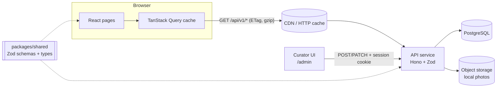
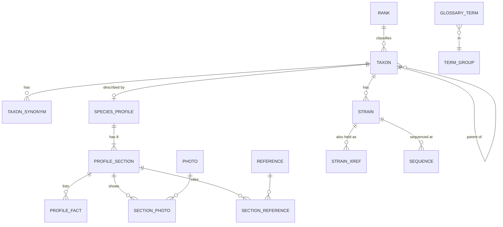

# Backend architecture and data model

Status: **proposal** · Scope: Meet the Fungi (`mycologystudy`) · Last updated: 2026-10-07

This document designs a database, an HTTP API and a data-fetching layer (TanStack Query) for the site,
so that species profiles, strains, taxonomy, references and photos can be edited by curators instead of
being hard-coded in `src/data/*.ts`.

---

## 1. Starting point and constraints

| Today | Consequence for the design |
|---|---|
| All content lives in typed TS files (`species.ts`, `taxonomy.ts`, `references.ts`, `photos.ts`, `topics.ts`, ~1,700 lines). | The shapes are already well defined. The schema mirrors them; a one-off seed script can import them. |
| Every text field is bilingual: `L = { en, vi }`. | Store both languages together and send both to the browser. Switching language must never trigger a network request. |
| Content is **read-mostly**: it changes when a curator edits, not when a visitor clicks. | Aggressive HTTP caching and long TanStack Query `staleTime` are safe and are the main performance lever. |
| The frontend is deployed to **GitHub Pages** (static hosting only). | GitHub Pages cannot run an API. A backend needs its own host (section 9), or the data must be pre-built to static JSON (Phase 0, section 10). |
| Photos have credit and licence fields, and one photo's licence is still unconfirmed. | Licence status becomes data, and unverified photos are blocked from publishing by the database itself. |

### A note on "TanStack Query in the backend"

TanStack Query is a **client-side** server-state cache. It does not run on the server. Its job on the
backend side is indirect: the API should be *shaped* so the cache works well. That means:

- one endpoint per cacheable resource, mapping 1:1 to a query key;
- stable, deterministic JSON (same input → same bytes → same ETag);
- `ETag` / `Cache-Control` so refetches are cheap (`304 Not Modified`);
- a consistent error format, so the client can tell "retry" (5xx, network) from "don't retry" (4xx);
- version fields on editable records, so mutations can be optimistic and still safe.

Sections 6 and 7 cover both halves.

---

## 2. Architecture overview



**Stack choice (TypeScript end to end):**

| Layer | Choice | Why |
|---|---|---|
| Database | PostgreSQL 16 | Relational data with a real hierarchy (taxa), JSONB for bilingual text, `pg_trgm` + `unaccent` for Vietnamese-friendly search. |
| ORM / migrations | Drizzle ORM + drizzle-kit | SQL-shaped, fully typed, plain SQL migrations under version control. |
| API framework | Hono | Small, fast, runs on Node, Bun, Cloudflare Workers or Deno, so hosting stays flexible. Built-in Zod validator and secure headers. |
| Validation / contract | Zod | One schema validates requests on the server *and* types responses on the client. |
| Client data layer | TanStack Query v5 | Caching, deduplication, background refresh, prefetching, mutations with rollback. |
| Auth (curators only) | OIDC (e.g. institutional SSO or GitHub) → httpOnly session cookie | Visitors never log in; only writes are protected. |

**Repository layout** (npm workspaces):

```
apps/
  web/                 # the existing Vite + React site (moved from the repo root)
  api/                 # Hono service
    src/
      routes/          # one file per resource: species.ts, strains.ts, taxa.ts ...
      services/        # business rules (publishing checks, lineage building)
      db/              # drizzle schema, migrations, seed
      middleware/      # auth, rate limit, etag, error handler
packages/
  shared/              # Zod schemas, inferred types, enums (RankKey, SectionKey ...)
docs/
  ARCHITECTURE.md
```

---

## 3. Database schema

### 3.1 Design decisions

1. **Bilingual text as validated JSONB.** A `localized_text` domain stores `{"en": "...", "vi": "..."}`
   and a CHECK constraint guarantees both keys exist and are non-empty. This matches the frontend's
   `L` type exactly, keeps one row per fact, and avoids a join per text field.
   *Alternative considered:* a `translation(entity, field, lang, text)` table. It is more flexible for
   many languages but adds a join to every query. Not worth it for two fixed languages.
2. **Taxonomy as an adjacency list** (`taxon.parent_id`), with lineage built by a recursive CTE and cached
   in a materialized view. The tree is small (thousands of rows at most), so this is simple and fast.
3. **Enums for closed vocabularies** (`rank_key`, `section_key`, `strain_status`, `locus` ...), so typos
   are impossible and the values match the TypeScript unions in `packages/shared`.
4. **Draft / published workflow** on everything visitors see: `status` + `published_at`. Public
   endpoints only ever read `published` rows.
5. **Optimistic concurrency:** every editable table has `version integer`, which is incremented on update.
   Edits send the version they started from, and a mismatch returns `409 Conflict`.
6. **Surrogate UUID keys** internally; **human slugs/accessions** in URLs (`aspergillus-fumigatus`,
   `CBS 133.61`), each with a unique index.

### 3.2 Entity-relationship diagram



### 3.3 DDL (PostgreSQL)

```sql
create extension if not exists pg_trgm;
create extension if not exists unaccent;

-- Bilingual text: {"en": "...", "vi": "..."}, both required and non-empty.
create domain localized_text as jsonb
  check (
    jsonb_typeof(value) = 'object'
    and value ?& array['en', 'vi']
    and length(trim(value->>'en')) > 0
    and length(trim(value->>'vi')) > 0
  );

create type content_status as enum ('draft', 'published', 'archived');
create type rank_tier      as enum ('principal', 'secondary', 'infraspecific', 'informal');
create type rank_key       as enum ('kingdom','subkingdom','phylum','subphylum','class','subclass',
                                    'order','family','genus','subgenus','section','series',
                                    'species','variety','forma','forma_specialis','strain');
create type section_key    as enum ('identity','morphology','physiology','ecology',
                                    'chemistry','pathogenicity','susceptibility','dna');
create type strain_status  as enum ('ex_type','typical','reference','genome_reference','other');
create type locus          as enum ('ITS','LSU','BenA','CaM','RPB2','TEF1');
create type reference_kind as enum ('article','book','website','guideline');
create type photo_license_status as enum ('unverified','verified');

-- Shared columns: id, version, timestamps, status
-- (written out per table below for clarity)

create table rank (
  key         rank_key primary key,
  tier        rank_tier not null,
  label       localized_text not null,
  description localized_text not null,
  ending      text check (ending ~ '^-[a-z]+$'),        -- '-mycota', '-ales' ...
  sort_order  smallint not null unique
);

create table taxon (
  id           uuid primary key default gen_random_uuid(),
  parent_id    uuid references taxon(id) on delete restrict,
  rank         rank_key not null references rank(key),
  name         text not null check (length(name) between 2 and 200),
  authority    text,                                    -- 'Fresen.'
  year         smallint check (year between 1700 and 2100),
  mycobank_id  integer unique,                          -- 211776
  is_accepted  boolean not null default true,
  version      integer not null default 1,
  created_at   timestamptz not null default now(),
  updated_at   timestamptz not null default now(),
  unique (parent_id, rank, name),
  check (parent_id is not null or rank = 'kingdom')
);
create index taxon_parent_idx on taxon(parent_id);
create index taxon_name_trgm  on taxon using gin (lower(unaccent(name)) gin_trgm_ops);

create table taxon_synonym (
  taxon_id  uuid not null references taxon(id) on delete cascade,
  name      text not null,
  note      localized_text,                             -- 'name once used for its sexual form'
  primary key (taxon_id, name)
);

-- Lineage cache: every taxon with its ancestors, top-down. Refreshed after taxonomy edits.
create materialized view taxon_lineage as
with recursive up as (
  select t.id as taxon_id, t.id as ancestor_id, 0 as depth from taxon t
  union all
  select up.taxon_id, p.parent_id, up.depth + 1
  from up join taxon p on p.id = up.ancestor_id
  where p.parent_id is not null
)
select up.taxon_id, up.depth, a.id as ancestor_id, a.rank, a.name
from up join taxon a on a.id = up.ancestor_id;
create unique index taxon_lineage_pk on taxon_lineage(taxon_id, ancestor_id);

create table photo (
  id              uuid primary key default gen_random_uuid(),
  commons_file    text,                                 -- Wikimedia Commons file name
  storage_key     text,                                 -- or our own object storage key
  alt             localized_text not null,
  caption         localized_text not null,
  author          text not null,
  license         text not null,
  license_status  photo_license_status not null default 'unverified',
  source_url      text check (source_url ~ '^https://'),
  ratio           text check (ratio ~ '^\d+ / \d+$'),
  fit             text check (fit in ('cover','contain')),
  check ((commons_file is null) <> (storage_key is null))  -- exactly one source
);

create table species_profile (
  id           uuid primary key default gen_random_uuid(),
  taxon_id     uuid not null unique references taxon(id),
  slug         text not null unique check (slug ~ '^[a-z0-9]+(-[a-z0-9]+)*$'),
  common_name  localized_text not null,
  form         localized_text not null,                 -- mould / yeast / mushroom
  tags         localized_text[] not null default '{}',
  hero_photo_id uuid references photo(id),
  status       content_status not null default 'draft',
  published_at timestamptz,
  version      integer not null default 1,
  updated_at   timestamptz not null default now(),
  check (status <> 'published' or published_at is not null)
);

create table profile_section (
  id          uuid primary key default gen_random_uuid(),
  profile_id  uuid not null references species_profile(id) on delete cascade,
  key         section_key not null,
  summary     localized_text not null,
  version     integer not null default 1,
  unique (profile_id, key)                              -- exactly one of each category
);

create table profile_fact (
  id          uuid primary key default gen_random_uuid(),
  section_id  uuid not null references profile_section(id) on delete cascade,
  label       localized_text not null,
  value       localized_text not null,
  sort_order  smallint not null,
  unique (section_id, sort_order)
);

create table section_photo (
  section_id  uuid references profile_section(id) on delete cascade,
  photo_id    uuid references photo(id) on delete restrict,
  sort_order  smallint not null,
  primary key (section_id, photo_id)
);

create table reference (
  id         text primary key check (id ~ '^[a-z]+[0-9]{4}[a-z]?$|^[a-z]+$'),  -- 'samson2014'
  kind       reference_kind not null,
  authors    text not null,
  year       text not null,                             -- '2014' or 'online'
  title      text not null,
  source     text not null,
  url        text not null check (url ~ '^https://'),
  doi        text unique check (doi ~ '^10\.\d{4,9}/\S+$'),
  used_for   localized_text not null
);

create table section_reference (
  section_id    uuid references profile_section(id) on delete cascade,
  reference_id  text references reference(id) on delete restrict,
  primary key (section_id, reference_id)
);

create table strain (
  id           uuid primary key default gen_random_uuid(),
  taxon_id     uuid not null references taxon(id),
  collection   text not null check (collection ~ '^[A-Z]{2,10}$'),  -- 'CBS'
  accession    text not null,                                       -- '133.61'
  status       strain_status not null,
  note         localized_text not null,
  substrate    text,                                                -- 'chicken lung'
  country      char(2),                                             -- ISO 3166-1, 'US'
  is_orderable boolean not null default false,
  version      integer not null default 1,
  unique (collection, accession)
);
create index strain_taxon_idx on strain(taxon_id);

create table strain_xref (                       -- '= NRRL 163 = ATCC 1022 ...'
  strain_id   uuid references strain(id) on delete cascade,
  collection  text not null,
  accession   text not null,
  primary key (strain_id, collection, accession)
);

create table sequence (
  strain_id  uuid references strain(id) on delete cascade,
  locus      locus not null,
  genbank    text not null check (genbank ~ '^[A-Z]{1,2}[0-9]{5,8}(\.[0-9]+)?$'),
  primary key (strain_id, locus, genbank)
);

create table glossary_term (
  id          uuid primary key default gen_random_uuid(),
  term_group  text not null check (term_group in ('naming','tree','collections')),
  term        localized_text not null,
  meaning     localized_text not null,
  example     localized_text,
  -- accent-insensitive search text in both languages ('chung' finds 'chủng')
  search_text text generated always as (
    lower(unaccent(term->>'en' || ' ' || term->>'vi' || ' ' || meaning->>'en' || ' ' || meaning->>'vi'))
  ) stored
);
create index glossary_search_trgm on glossary_term using gin (search_text gin_trgm_ops);
```

> `unaccent()` is not marked immutable by default, so the generated column needs a small
> immutable wrapper function (`create function f_unaccent(text) ... immutable`). This is a standard
> pattern; the migration will include it.

**Integrity rule that guards publishing** (the unverified-licence case from the *A. fumigatus* plate):

```sql
-- A profile cannot be published while any of its photos has an unverified licence.
create function assert_publishable() returns trigger language plpgsql as $$
begin
  if new.status = 'published' and exists (
    select 1
    from profile_section s
    join section_photo sp on sp.section_id = s.id
    join photo p on p.id = sp.photo_id
    where s.profile_id = new.id and p.license_status <> 'verified'
  ) then
    raise exception 'profile % has photos with unverified licences', new.slug
      using errcode = 'check_violation';
  end if;
  return new;
end $$;
create trigger species_profile_publishable
  before insert or update of status on species_profile
  for each row execute function assert_publishable();
```

### 3.4 Database roles (least privilege)

| Role | Grants | Used by |
|---|---|---|
| `app_read` | `select` on published views only | public API routes |
| `app_write` | `select, insert, update` on content tables; no `delete` on `reference`/`photo` | curator routes |
| `app_migrate` | DDL | CI migrations only, never the running service |

Public routes read from views such as `published_species_profile`, so a bug in a public handler can never
leak drafts.

---

## 4. API design

Base path: `/api/v1`. JSON only. All responses include both languages; the client picks one.

### 4.1 Public endpoints (no auth, cacheable)

| Method & path | Returns | Query params | Cache |
|---|---|---|---|
| `GET /species` | List of profile summaries (slug, name, form, common name, hero photo) | `form`, `q`, `limit` (≤50), `cursor` | 5 min + SWR |
| `GET /species/:slug` | Full profile: 8 sections, facts, photos, citations, lineage | – | 5 min + SWR |
| `GET /species/:slug/strains` | Strains with xrefs, sequences, `orderUrl` | `status` | 5 min + SWR |
| `GET /strains/:collection/:accession` | One strain (`/strains/CBS/133.61`) | – | 1 h |
| `GET /taxa/:id/lineage` | Ancestors top-down, with rank tier and ending | – | 1 h |
| `GET /ranks` | Rank ladder definitions | – | 1 day |
| `GET /taxonomy/examples` | The worked examples on the Names & ranks page | – | 1 h |
| `GET /glossary` | All terms (small; searched client-side) | `group` | 1 h |
| `GET /glossary/search` | Server-side accent-insensitive search for large lists | `q` (2–60 chars) | 5 min |
| `GET /references` | Ordered reference list (numbering is stable) | – | 1 day |
| `GET /healthz` | `{ status: "ok", db: "ok" }` | – | no-store |

### 4.2 Curator endpoints (session + role `curator`/`admin`, never cached)

| Method & path | Body | Notes |
|---|---|---|
| `POST /admin/species` | `SpeciesProfileCreate` | Creates a draft with all 8 empty sections. |
| `PATCH /admin/species/:slug` | partial profile + `version` | `409` on version mismatch. |
| `PUT /admin/species/:slug/sections/:key` | section with ordered facts, photo ids, reference ids + `version` | Replaces the section atomically in one transaction. |
| `POST /admin/species/:slug/publish` | `{ version }` | Fails with `422` if a photo licence is unverified. |
| `POST /admin/strains` · `PATCH /admin/strains/:id` | `StrainInput` | Unique `(collection, accession)` → `409`. |
| `POST /admin/photos` · `PATCH /admin/photos/:id` | `PhotoInput` | Setting `licenseStatus: verified` requires `admin`. |
| `POST /admin/references` · `PATCH /admin/references/:id` | `ReferenceInput` | |
| `POST /admin/taxa` · `PATCH /admin/taxa/:id` | `TaxonInput` | Refreshes `taxon_lineage` concurrently after commit. |

### 4.3 Response conventions

- **Success:** the resource itself (no `{ data: ... }` envelope) plus headers:
  `ETag: "<hash of body>"`, `Cache-Control: public, max-age=300, stale-while-revalidate=86400`.
- **Lists:** `{ items: [...], nextCursor: string | null }`. Cursors are opaque (base64 of the last sort key),
  so pages stay stable while content is edited.
- **Errors:** RFC 9457 `application/problem+json`:

```json
{
  "type": "https://mycologystudy.dev/problems/validation",
  "title": "Invalid request",
  "status": 400,
  "detail": "Query parameter 'limit' must be between 1 and 50.",
  "errors": [{ "path": ["limit"], "message": "Number must be less than or equal to 50" }],
  "requestId": "01J9Z8..."
}
```

| Status | Meaning | Client retries? |
|---|---|---|
| 400 / 422 | Validation or business-rule failure | No |
| 401 / 403 | Not signed in / not allowed | No |
| 404 | Unknown slug or accession | No |
| 409 | Version conflict or duplicate accession | No (refetch, show conflict) |
| 429 | Rate limited (`Retry-After` header) | Yes, after the delay |
| 5xx / network | Server or transport problem | Yes, with backoff |

---

## 5. Validation: one contract, two sides

Schemas live in `packages/shared` and are imported by both the API and the web app.

```ts
// packages/shared/src/schemas.ts
import { z } from 'zod'

export const Localized = z.object({
  en: z.string().trim().min(1).max(2000),
  vi: z.string().trim().min(1).max(2000),
})
export type L = z.infer<typeof Localized>

export const SectionKey = z.enum([
  'identity', 'morphology', 'physiology', 'ecology',
  'chemistry', 'pathogenicity', 'susceptibility', 'dna',
])

export const Accession = z.object({
  collection: z.string().regex(/^[A-Z]{2,10}$/),     // 'CBS'
  accession: z.string().regex(/^[0-9A-Za-z.\-]{1,20}$/), // '133.61'
})

export const StrainInput = Accession.extend({
  taxonId: z.string().uuid(),
  status: z.enum(['ex_type', 'typical', 'reference', 'genome_reference', 'other']),
  note: Localized,
  substrate: z.string().max(200).optional(),
  country: z.string().length(2).toUpperCase().optional(),
  isOrderable: z.boolean().default(false),
  xrefs: z.array(Accession).max(30).default([]),
  sequences: z.array(z.object({
    locus: z.enum(['ITS', 'LSU', 'BenA', 'CaM', 'RPB2', 'TEF1']),
    genbank: z.string().regex(/^[A-Z]{1,2}[0-9]{5,8}(\.[0-9]+)?$/),
  })).max(20).default([]),
})

export const SectionInput = z.object({
  version: z.number().int().positive(),
  summary: Localized,
  facts: z.array(z.object({ label: Localized, value: Localized })).max(20),
  photoIds: z.array(z.string().uuid()).max(6),
  referenceIds: z.array(z.string().regex(/^[a-z0-9]+$/)).max(20),
})

export const SpeciesListQuery = z.object({
  form: z.enum(['mould', 'yeast', 'mushroom']).optional(),
  q: z.string().trim().min(2).max(60).optional(),
  limit: z.coerce.number().int().min(1).max(50).default(20),
  cursor: z.string().max(200).optional(),
})
```

Server usage (Hono):

```ts
// apps/api/src/routes/species.ts
import { Hono } from 'hono'
import { zValidator } from '@hono/zod-validator'
import { SpeciesListQuery, SectionInput, SectionKey } from '@mycologystudy/shared'

export const species = new Hono()
  .get('/', zValidator('query', SpeciesListQuery), async (c) => {
    const query = c.req.valid('query')
    return c.json(await speciesService.list(query))
  })
  .get('/:slug', async (c) => {
    const profile = await speciesService.getPublished(c.req.param('slug'))
    if (!profile) throw notFound('species', c.req.param('slug'))
    return c.json(profile)
  })

export const adminSpecies = new Hono()
  .put('/:slug/sections/:key',
    requireRole('curator'),
    zValidator('param', z.object({ slug: z.string(), key: SectionKey })),
    zValidator('json', SectionInput),
    async (c) => {
      const { slug, key } = c.req.valid('param')
      const updated = await speciesService.replaceSection(slug, key, c.req.valid('json'), c.get('user'))
      return c.json(updated)   // returns the new version for the client cache
    })
```

Layers stay separate: **route** (parse, validate, map errors) → **service** (rules, transactions) →
**repository** (Drizzle queries). Services never see raw HTTP; routes never write SQL.

---

## 6. Backend practices that make TanStack Query effective

1. **Granular, stable resources.** Each endpoint maps to one query key (section 7.1). The profile
   endpoint returns everything one page needs in one request, so there are no request waterfalls. Strains
   have their own endpoint, so they can be refreshed without refetching the profile.
2. **Both languages in every payload.** The language switch is a pure render change: no new query key,
   no refetch, no loading state.
3. **ETags with `If-None-Match`.** Background refetches (window focus, `invalidateQueries`) usually cost
   a `304` with an empty body. A middleware hashes the serialized body (SHA-1 is fine; this is not security).
4. **`Cache-Control` with `stale-while-revalidate`** lets a CDN absorb read traffic. Curator writes purge
   the affected paths (`/species/:slug`, `/species`) at the CDN.
5. **Mutations return the updated resource**, including its new `version`. The client writes it straight
   into the cache with `setQueryData`, so no extra GET is needed.
6. **Problem+JSON with correct status codes**, so the client's `retry` function can skip 4xx.
7. **Deterministic ordering** (explicit `sort_order` columns, `order by` in every list query), so identical
   data yields identical JSON and identical ETags.

---

## 7. Frontend data layer (TanStack Query v5)

### 7.1 Query keys and options in one place

```ts
// apps/web/src/api/queries.ts
import { queryOptions, infiniteQueryOptions, keepPreviousData } from '@tanstack/react-query'
import { api } from './client'

export const keys = {
  all: ['v1'] as const,
  species: () => [...keys.all, 'species'] as const,
  speciesList: (f: { form?: string; q?: string }) => [...keys.species(), 'list', f] as const,
  speciesDetail: (slug: string) => [...keys.species(), 'detail', slug] as const,
  strains: (slug: string) => [...keys.species(), 'detail', slug, 'strains'] as const,
  ranks: () => [...keys.all, 'ranks'] as const,
  glossary: () => [...keys.all, 'glossary'] as const,
  references: () => [...keys.all, 'references'] as const,
}

export const speciesDetail = (slug: string) =>
  queryOptions({
    queryKey: keys.speciesDetail(slug),
    queryFn: ({ signal }) => api.get(`/species/${slug}`, SpeciesProfile, signal),
    staleTime: 5 * 60_000,
  })

export const speciesList = (filters: { form?: string; q?: string }) =>
  infiniteQueryOptions({
    queryKey: keys.speciesList(filters),
    queryFn: ({ pageParam, signal }) =>
      api.get('/species', SpeciesPage, signal, { ...filters, cursor: pageParam }),
    initialPageParam: undefined as string | undefined,
    getNextPageParam: (last) => last.nextCursor ?? undefined,
    placeholderData: keepPreviousData,   // no flicker while the search text changes
  })

// Rarely changing reference data
export const references = () =>
  queryOptions({ queryKey: keys.references(), queryFn: ({ signal }) => api.get('/references', ReferenceList, signal), staleTime: Infinity })
```

`queryOptions` keeps key, fetcher and types together, so `useQuery`, `prefetchQuery` and
`setQueryData` all stay type-safe.

### 7.2 Client defaults

```ts
// apps/web/src/api/queryClient.ts
export const queryClient = new QueryClient({
  defaultOptions: {
    queries: {
      staleTime: 60_000,          // content is read-mostly
      gcTime: 30 * 60_000,
      refetchOnWindowFocus: true, // cheap thanks to ETag → 304
      retry: (count, error) => !(error instanceof ApiError && error.status < 500) && count < 3,
    },
    mutations: { retry: false },
  },
})
```

The fetch client validates every response with the shared Zod schema. A contract drift fails loudly in
development instead of rendering `undefined`.

```ts
// apps/web/src/api/client.ts
async function get<T>(path: string, schema: z.ZodType<T>, signal?: AbortSignal, params?: object): Promise<T> {
  const res = await fetch(url(path, params), { signal, headers: { Accept: 'application/json' } })
  if (!res.ok) throw await ApiError.from(res)           // parses problem+json
  return schema.parse(await res.json())
}
```

### 7.3 Patterns used on this site

| Page | Pattern |
|---|---|
| Species list | `useInfiniteQuery(speciesList(filters))`; search text debounced 250 ms; `keepPreviousData`. |
| Species card hover/focus | `queryClient.prefetchQuery(speciesDetail(slug))`, so the profile opens instantly. |
| Species profile | `useSuspenseQuery(speciesDetail(slug))` inside a route-level `<Suspense>` + error boundary (404 → `NotFound`). |
| Strains section | Separate `useQuery(strains(slug))`, so it can show its own loading state below the fold. |
| Names & ranks | `ranks()` and `taxonomy/examples` with `staleTime: Infinity`. Example and tier switching stays local state (no refetch). |
| Glossary | Whole list cached once; filtering stays client-side as today (it is ~25 terms). Switch to `/glossary/search` only if it grows past a few hundred. |
| References / citations | `references()` with `staleTime: Infinity`; `Cite` reads numbering from the cache with `select`. |

### 7.4 Curator mutations: optimistic, with rollback and conflict handling

```ts
export function useSaveSection(slug: string, key: SectionKey) {
  const qc = useQueryClient()
  return useMutation({
    mutationFn: (input: SectionInput) => api.put(`/admin/species/${slug}/sections/${key}`, input, SpeciesProfile),
    onMutate: async (input) => {
      await qc.cancelQueries({ queryKey: keys.speciesDetail(slug) })
      const previous = qc.getQueryData(keys.speciesDetail(slug))
      qc.setQueryData(keys.speciesDetail(slug), (old) => old && applySection(old, key, input))
      return { previous }
    },
    onError: (err, _input, ctx) => {
      qc.setQueryData(keys.speciesDetail(slug), ctx?.previous)   // roll back
      if (err instanceof ApiError && err.status === 409) toast.conflict()  // someone else edited it
    },
    onSuccess: (saved) => qc.setQueryData(keys.speciesDetail(slug), saved), // server truth + new version
    onSettled: () => qc.invalidateQueries({ queryKey: keys.speciesList({}), exact: false }),
  })
}
```

Because keys are hierarchical (`['v1','species', ...]`), one
`invalidateQueries({ queryKey: keys.species() })` refreshes every species view after a bulk import.

---

## 8. Security

| Concern | Measure |
|---|---|
| Input | Zod on every param, query and body; body size limit (64 kB); string length caps; enums for closed sets. |
| SQL injection | Drizzle parameterized queries only; no string-built SQL. Lint rule bans `sql.raw` outside migrations. |
| AuthN | Curators sign in through OIDC; the API sets an httpOnly, `Secure`, `SameSite=Lax` session cookie (rotated, 8 h). Visitors never authenticate. |
| AuthZ | Roles `curator` (edit drafts) and `admin` (publish, verify licences, manage users), checked in middleware *and* re-checked in services. |
| CSRF | Cookie is `SameSite=Lax`; all writes are non-GET and require a custom `X-Requested-With` header plus an Origin check. |
| CORS | Allowlist: `https://suemy19710.github.io` and `http://localhost:5173`. Credentials only for `/admin`. |
| Headers | Hono `secureHeaders` (HSTS, nosniff, frame-deny, strict referrer policy). |
| Abuse | Rate limit public reads per IP (e.g. 120/min) and search harder (30/min); `429` + `Retry-After`. |
| Data exposure | Public routes read published views via the `app_read` role; drafts are unreachable. |
| Outbound links | `url`/`source_url` must be `https://`; photo hosts allowlisted (`commons.wikimedia.org`, own storage). |
| Content licensing | Publishing is blocked in the database while any photo licence is `unverified` (section 3.3). |
| Secrets | Database URL and OIDC secrets come from the host's secret store; nothing in the repo or the web bundle. |
| Audit | `audit_log(actor, action, entity, entity_id, diff jsonb, at)` written in the same transaction as each curator change. |

---

## 9. Performance and operations

- **Indexes:** unique slugs/accessions, FK indexes, trigram GIN for name and glossary search, and the
  `taxon_lineage` materialized view (refreshed `concurrently` after taxonomy edits).
- **One query per page:** the profile endpoint assembles sections, facts, photos and citations with
  `json_agg` in a single SQL round trip (no N+1).
- **Compression:** gzip/brotli at the CDN; typical profile payload is ~15–25 kB raw, ~5 kB compressed.
- **Connection pooling:** a serverless driver/pooler (e.g. Neon or PgBouncer); pool size sized to the host.
- **Hosting (suggested):** frontend stays on GitHub Pages; API on a small container host (Fly.io, Render,
  Railway) or Cloudflare Workers (Hono runs on both); managed Postgres (Neon, Supabase, or Render).
  Set `VITE_API_URL` at build time in the existing deploy workflow.
- **Observability:** structured JSON logs (pino) with a `requestId` echoed in error bodies; `/healthz`
  for uptime checks; slow-query log over 200 ms.
- **Testing:**
  - API: Vitest + Testcontainers Postgres; every route tested for 200/400/404/409.
  - Contract: snapshot of each Zod schema; CI fails on unreviewed breaking changes.
  - Frontend: hooks tested against MSW handlers generated from the same schemas.
  - Migrations: applied to a fresh database in CI, then `seed` and a smoke test run.

---

## 10. Rollout plan

The API contract is designed so the frontend can adopt TanStack Query **before** a server exists.

| Phase | What changes | Hosting impact |
|---|---|---|
| **0. Static JSON** | A build script validates `src/data/*.ts` with the shared Zod schemas and writes `public/api/v1/*.json` (e.g. `species/aspergillus-fumigatus.json`). Pages fetch them through the TanStack Query hooks above. | None: still GitHub Pages only. |
| **1. Read API** | Postgres + Hono with the public endpoints; the seed script imports the same TS data. Only `VITE_API_URL` changes; hooks and components are untouched. | Adds an API host and a database. |
| **2. Curator tools** | `/admin` routes, OIDC login, draft/publish, audit log, licence verification. | Same. |
| **3. Scale-out (if needed)** | CDN purge on publish, read replica, server-side glossary search. | Only when traffic or content size calls for it. |

**Recommendation:** start with Phase 0. Today's content is small, rarely changes and is edited by the
project team in code, so a live database adds cost and operational work without a user-visible benefit.
Phase 0 still delivers the TanStack Query architecture, validated data and the exact API shapes, and moving
to Phase 1 is a configuration change, not a rewrite. Move to Phase 1 when non-developers need to edit
content, or when strain data should sync with the CBS collection.

---

## 11. Open questions

1. Who will edit content: only the project team (Phase 0 is enough), or curators without Git access (Phase 1–2)?
2. Can strain availability be pulled from the CBS catalogue programmatically, or must it be entered by hand?
   (The catalogue at `wi.knaw.nl/fungal_table` currently has no per-strain URLs.)
3. Which identity provider should curators use (institutional SSO, GitHub, email magic link)?
4. Budget and hosting preference for the API and database.
